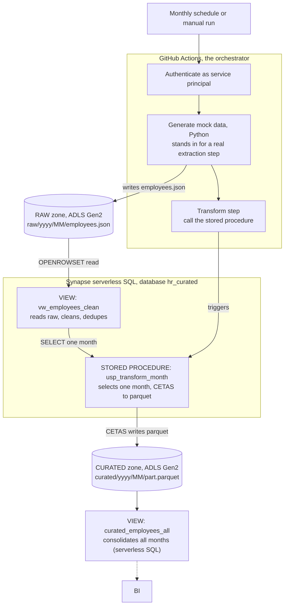

# HR Data Pipeline on Azure

A monthly HR analytics pipeline built as an ELT lakehouse on Azure. Every month a full
headcount snapshot is generated, landed untouched in a raw zone, cleaned and modeled in
SQL, and written to a curated parquet layer that BI can read.

The data is synthetic (no real PII) and follows a real HR feed pattern: each month is the
prior month's survivors, minus leavers, plus new hires, with the same `employee_id`
recurring across months. This is a periodic snapshot, so filtering by month gives the exact
headcount as of that month.

## Architecture



## How it works

1. **Generate.** A Python step produces the month's full roster (around 1,000 employees and
   growing, deliberately messy) and writes it as a single immutable file to
   `raw/{yyyy}/{MM}/employees.json`. Generation is deterministic per `(seed, month)`, so a
   re-run produces identical bytes and raw never changes.
2. **Transform.** A serverless SQL stored procedure reads that month's raw JSON straight from
   the lake with `OPENROWSET`, cleans and models it in T-SQL through a reusable view, and
   `CETAS`-writes the result to `curated/{yyyy}/{MM}/` as parquet. No second compute service:
   the transform runs as SQL in place over the lake.
3. **Serve.** BI connects to the serverless pool and reads `curated_employees_all`, a view
   that consolidates every monthly partition into one table. Building the reports is out of
   scope; this view is the handoff point.

Both zones are partitioned by year and month, so the serverless engine prunes to a single
month's folder when the proc filters on it.

## Data model

The source is a monthly full-roster snapshot with churn:

| Month | Headcount | Change |
|-------|-----------|--------|
| 2026-01 | 1000 | seed |
| 2026-02 | 1167 | +200 hired, -33 left |
| 2026-03 | 1312 | +200 hired, -55 left |
| 2026-04 | 1467 | +200 hired, -45 left |
| 2026-05 | 1606 | +200 hired, -61 left |
| 2026-06 | ~1700 | written by the automated pipeline |

Raw values are intentionally dirty (mixed date formats, `R$ 8.500,00` style money, casing and
abbreviation noise, duplicate rows, null tokens). The transform normalizes all of it to a
typed, deduplicated curated schema. The full mapping is in
[docs/DATA_CONTRACT.md](docs/DATA_CONTRACT.md).

## Security

Nothing secret lives in the repo. The GitHub Actions runner authenticates to Azure as a
least-privilege service principal that has `Storage Blob Data Contributor` on the lake and is a
`db_owner` of the curated database, and nothing else. Credentials live in GitHub Secrets.
Inside the proc, the lake read and write are done by the Synapse workspace managed identity
through an external data source, not by the caller. Region is Brazil South for data residency.

## Tech stack

- **Storage:** Azure Data Lake Storage Gen2 (hierarchical namespace), two zones (raw, curated)
- **Transform:** Azure Synapse serverless SQL pool (`OPENROWSET`, clean view, `CETAS`)
- **Extraction:** Python 3.11 (standard library only), run as a GitHub Actions step
- **Orchestration:** GitHub Actions (monthly schedule plus manual dispatch)
- **Infrastructure:** Terraform (resource group, lake, Synapse workspace, RBAC)
- **CI:** GitHub Actions running `ruff` and `pytest`

## Repository layout

```
.
├── functions/            # Python: the Generate logic (shared/ is unit-testable, no Azure bindings)
├── synapse/sql/          # the transform: setup, clean view, CETAS proc, backfill
├── infra/                # Terraform for the Azure footprint
├── scripts/              # run_generate.py, run_transform.py (the pipeline steps)
├── tests/                # pytest for the Python side
├── docs/DATA_CONTRACT.md # raw schema, messiness catalog, curated target
└── .github/workflows/    # monthly-pipeline.yml (data) and ci.yml (lint + tests)
```
